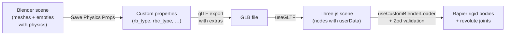

# Blender Export Guide

## 1. Introduction

This project uses Blender as the authoring tool for pop-up card mechanisms and a custom export pipeline to bring them into a Three.js + Rapier physics simulation. Because glTF has no native rigid-body schema, Blender's physics settings are mirrored into **custom properties** before export. These custom properties survive the glTF export as `extras` and appear as `userData` on Three.js nodes, where a Zod-validated loader parses them into Rapier rigid bodies and revolute joints.

---

## 2. Blender Scene Requirements

### 2a. Object Types

| Blender type | Role in the simulation | Required physics |
|---|---|---|
| **Mesh** | Card panel (a flat plane) | Rigid Body |
| **Empty** | Hinge / joint between two panels | Rigid Body Constraint (Hinge) |

Empties carry no geometry. Their **position** defines the joint anchor and their **local Z-axis** (blue) must point along the fold axis.

### 2b. Naming Conventions

Object names must be **unique and stable** — they are used as lookup keys in Three.js (`nodes[name]`) and in hinge constraint references (`rbc_object1`, `rbc_object2`).

Convention for hinge empties: **`[PlaneA]_[PlaneB]_Hinge`**

Example for a V-fold mechanism:

| Object | Type | Role |
|---|---|---|
| `LeftPlane` | Mesh | Driven plate (motor-controlled) |
| `RightPlane` | Mesh | Fixed base plate |
| `VFold_Left` | Mesh | Left V-fold panel |
| `VFold_Right` | Mesh | Right V-fold panel |
| `LeftPlane_RightPlane_Hinge` | Empty | Main fold (motor-driven) |
| `LeftPlane_VFold_Left_Hinge` | Empty | Left plane to left V-fold |
| `RightPlane_VFold_Right_Hinge` | Empty | Right plane to right V-fold |
| `VFold_Left_VFold_Right_Hinge` | Empty | V-fold panels to each other |

### 2c. Physics Setup

Each mesh needs a Blender **Rigid Body**. Each empty needs a **Rigid Body Constraint** of type Hinge with both `Object 1` and `Object 2` assigned (null references will fail Zod validation on the Three.js side).

Rigid body roles and how they map to Rapier:

| Role | Blender Type | Dynamic | Animated | Rapier type | How you move it | Can be pushed | Can push others |
|---|---|---|---|---|---|---|---|
| Physics-driven flaps | Active | Yes | OFF | `dynamic` | Physics/joints | Yes | Yes |
| User-controlled plane | Passive | — | Yes | `dynamic` | Joint motor (`configureMotorPosition`) | Yes | Yes |
| Static anchor | Passive | — | OFF | `fixed` | Nobody | No | No |

### 2d. Origin Placement

**Mesh origins must be at the geometry center.** Use `Object > Set Origin > Origin to Geometry` on all mesh objects before exporting.

Why: `@react-three/rapier`'s `colliders="cuboid"` auto-generation computes a collider offset from the geometry bounding-box center. It adds this offset to the rigid body position **without** rotating it by the node's quaternion. If the geometry is not centered on the node origin, the collider will be visibly displaced from the mesh.

The hinge pivot is defined by the **empty's position**, not the mesh's origin. Moving the mesh origin to geometry center does not affect where the joint rotates — only the empty position matters for that.

**Do not apply transforms to empties.** Their rotation encodes the hinge axis direction, and since empties have no geometry to absorb the transform, applying rotation would zero it out and lose the axis information.

---

## 3. The Export Addon

### 3a. Installation

The addon lives at `blender/export_popup_glb.py`. Two ways to install:

1. **Text Editor**: Open the file in Blender's Text Editor and click **Run Script**
2. **Preferences**: Edit > Preferences > Add-ons > Install… > select the file

Once active, a **"Pop-up Export"** panel appears in the 3D Viewport sidebar (**N-panel**, under the **Pop-up** tab).

### 3b. Panel Features

The panel has four sections:

**Include by Type** — Checkboxes for each Blender object type present in the scene, with live counts. Only types that exist are shown. Meshes and Empties are checked by default.

**Current Selection** — A read-only summary of the currently selected objects, grouped by type.

**Export Settings** — A subset of glTF export parameters with project-appropriate defaults:
- +Y Up (checked)
- Flatten Object Hierarchy (checked)
- Apply Modifiers (checked)
- UVs (checked)
- Normals (checked)

**Action Buttons:**
- **Save Physics Props** — Copies rigid body / constraint data to custom properties
- **Export Pop-up GLB** — One-click: saves physics props, selects objects by type filter, and exports a `.glb` file with the panel settings

### 3c. What "Save Physics Props" Does

glTF does not support Blender's rigid body data natively. This operator copies the physics settings into **custom properties** on each object, which glTF exports as `extras`:

**On meshes** (from `obj.rigid_body`):

| Custom property | Blender source | Example value |
|---|---|---|
| `rb_type` | `rigid_body.type` | `"ACTIVE"` or `"PASSIVE"` |
| `rb_animated` | `rigid_body.kinematic` | `true` / `false` |
| `rb_dynamic` | `rigid_body.enabled` | `true` / `false` |

**On empties** (from `obj.rigid_body_constraint`):

| Custom property | Blender source | Example value |
|---|---|---|
| `rbc_type` | `rigid_body_constraint.type` | `"HINGE"` |
| `rbc_object1` | `rigid_body_constraint.object1.name` | `"VFold_Left"` |
| `rbc_object2` | `rigid_body_constraint.object2.name` | `"LeftPlane"` |

If you rename an object after running Save Physics Props, the stored names become stale. Always re-run it after any rename.

---

## 4. Export Settings Explained

| Setting | Default | Purpose |
|---|---|---|
| `export_extras` | Always `True` | Includes custom properties in the GLB. Without this, `userData` is empty and the loader cannot parse physics data. |
| `export_yup` (+Y Up) | `True` | Converts Blender's Z-up coordinate system to glTF/Three.js Y-up. |
| `export_hierarchy_flatten_objs` | `True` | Flattens the object hierarchy so all nodes are at the scene root. Simplifies transform handling in the loader. |
| `export_apply` (Apply Modifiers) | `True` | Bakes modifiers into mesh data. Unapplied modifiers do not appear in the GLB. |
| `export_texcoords` (UVs) | `True` | Exports UV coordinates for texturing. |
| `export_normals` | `True` | Exports vertex normals for correct lighting. |
| Animation | Disabled | Physics-driven motion is created at runtime; baked Blender animations are not needed. |

---

## 5. How the GLB is Loaded (Three.js side)

### 5a. Loading

`useGLTF(path)` from `@react-three/drei` returns a `scene` (the full Three.js scene graph) and `nodes` (a flat `Record<string, Object3D>` keyed by name).

### 5b. Parsing

`useCustomBlenderLoader` (in `src/hooks/useCustomBlenderLoader.ts`) traverses the scene and validates each node's `userData` against Zod schemas:

- **Mesh nodes** are validated against `blenderPlaneUserDataSchema` (`rb_type`, `rb_animated`, `rb_dynamic`)
- **Object3D nodes** (empties) are validated against `blenderEmptyUserDataSchema` (`rbc_type`, `rbc_object1`, `rbc_object2`)
- Nodes that match neither schema are silently skipped

### 5c. Rigid Body Type Mapping

The loader maps Blender physics settings to Rapier body types:

| `rb_type` | `rb_animated` | `rb_dynamic` | Rapier `RigidBodyTypeString` |
|---|---|---|---|
| `ACTIVE` | — | `true` | `"dynamic"` |
| `ACTIVE` | — | `false` | `"kinematicPosition"` |
| `PASSIVE` | `true` | — | `"dynamic"` |
| `PASSIVE` | `false` | — | `"fixed"` |

### 5d. Hinge Extraction

For each empty with `rbc_type === "HINGE"`, the loader extracts:

- **Position**: `object.getWorldPosition()` — the joint anchor in world space
- **Quaternion**: `object.getWorldQuaternion()` — the empty's world orientation
- **Rotation axis**: Blender's local Z-axis (`[0, 0, 1]`) was aligned to the fold in Blender. After the Y-up conversion, this becomes `[0, 1, 0]` rotated by the world quaternion
- **Constraint objects**: `nodes[rbc_object1]` and `nodes[rbc_object2]` — the two Three.js nodes that the joint connects

---

## 6. Coordinate System

Blender uses **Z-up**; glTF and Three.js use **Y-up**. The `+Y Up` export option applies a -90 degree rotation around X to the entire scene during export.

The axis mapping is:

| Blender | glTF / Three.js |
|---|---|
| X | X |
| Y | -Z |
| Z | Y |

The loader accounts for this by using **world-space** queries (`getWorldPosition`, `getWorldQuaternion`) rather than reading local transforms directly. This means the Y-up root rotation is already baked into the returned values.

For hinge axes: in Blender you align the empty's **local Z** (blue axis) to the fold direction. After export, the loader recovers the world-space axis by rotating `[0, 1, 0]` (the Y-up equivalent of Blender's Z) by the empty's world quaternion.

---

## 7. Troubleshooting

### `useGLTF` caching

`useGLTF` caches GLB files by URL. After re-exporting from Blender, the browser may still serve the old file. **Hard-refresh** (Cmd+Shift+R / Ctrl+Shift+R) to bust the cache. Multiple refreshes may be needed if HMR re-renders with stale data.

### Renamed objects break hinge references

If you rename a mesh after running Save Physics Props, the `rbc_object1` / `rbc_object2` custom properties on hinge empties still reference the old name. The loader will fail to find the node and the joint will not be created. Always re-run Save Physics Props after renaming.

### Null constraint references

If a hinge empty's Rigid Body Constraint has a null `Object 1` or `Object 2` in Blender, the corresponding `rbc_object1` / `rbc_object2` custom property will not be set. The Zod schema requires both strings, so the empty will fail validation and be skipped with a console error.

### Collider misalignment (offset geometry)

If a mesh's origin is not at its geometry center, the auto-generated cuboid collider will be displaced. See [Section 2d](#2d-origin-placement) for the fix.

### Trimesh colliders on dynamic bodies

Rapier does not support `trimesh` colliders on dynamic rigid bodies. They silently fail — the body will have no collision response. Use `cuboid` or `hull` instead.

### Zero-thickness meshes

A perfectly flat plane (zero thickness) produces a zero-volume cuboid collider with no mass or inertia. Give meshes a small thickness in Blender (even 0.001 units) or use a `Solidify` modifier (with Apply Modifiers enabled on export).

---

## 8. Debugging with the Blender MCP

The [Blender MCP](https://github.com/ahujasid/blender-mcp) (Model Context Protocol) server lets an AI coding assistant inspect and modify the Blender scene directly from the IDE. This is invaluable for debugging export issues because it bridges the gap between the Blender authoring environment and the Three.js runtime.

### What it enables

- **Read object transforms** — Query any object's position, rotation, scale, and custom properties without switching to Blender. This lets you compare what Blender has against what the Three.js loader receives.
- **Check geometry centers** — Compute bounding boxes and verify that mesh origins are at geometry center (the collider alignment requirement from [Section 2d](#2d-origin-placement)).
- **Inspect constraint references** — Verify that `rbc_object1` / `rbc_object2` point to the correct objects and that the Rigid Body Constraint's `object1` / `object2` are not null.
- **Fix issues in-place** — Rename objects, reconnect broken constraints, run `bpy.ops.object.origin_set()`, or re-run the Save Physics Props logic without leaving the IDE.
- **Execute arbitrary Blender Python** — The `execute_blender_code` tool runs any `bpy` script and returns the output, making it possible to batch-query the entire scene state as JSON for comparison with runtime logs.

### Typical debugging workflow

1. Observe a problem in the browser (e.g., collider offset, hinge at wrong position)
2. Add instrumentation logs in the Three.js loader to capture runtime values (node positions, geometry centers, hinge world positions)
3. Query the same values from Blender via the MCP
4. Compare the two — discrepancies reveal where the pipeline breaks (stale custom props, un-centered origins, coordinate conversion errors, caching)

### Setup

Install the Blender MCP server following the instructions at [github.com/ahujasid/blender-mcp](https://github.com/ahujasid/blender-mcp). Once running, configure your IDE's MCP client to connect to the Blender server. The key tools are `get_scene_info`, `get_object_info`, and `execute_blender_code`.

---

## 9. Export Checklist

1. Verify all objects have **unique, meaningful names**
2. Verify all mesh objects have a **Rigid Body** assigned
3. Verify all hinge empties have a **Rigid Body Constraint** with both objects set
4. Verify hinge empties have their **local Z-axis** aligned to the fold direction
5. Run **Origin to Geometry** on all mesh objects (select meshes > `Object > Set Origin > Origin to Geometry`)
6. **Do not** apply transforms to empties
7. Open the **Pop-up Export** panel (N-panel > Pop-up tab)
8. Click **Save Physics Props**
9. Verify the **Include by Type** checkboxes (Meshes and Empties should be checked)
10. Click **Export Pop-up GLB** (or use File > Export > glTF with the settings from Section 4)
11. In the browser, **hard-refresh** (Cmd+Shift+R) after replacing the GLB file
